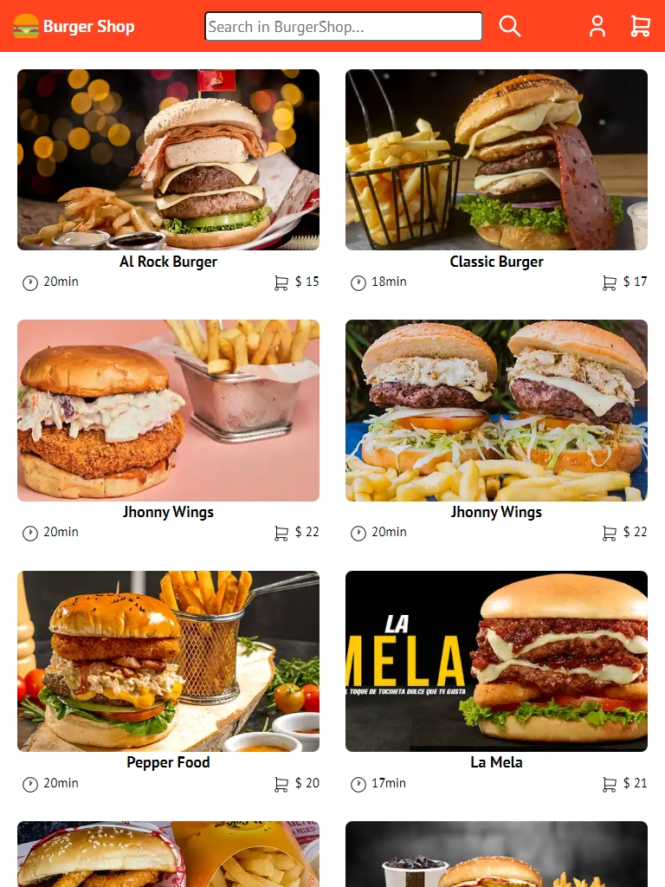

# 🏗️ Proyect: BurgerShop

📌 **Description**  
This project is a **responsive website** developed with HTML and CSS. Its objective is to provide a **modern and accessible interface** to display information about an online store for buying hamburgers.

# 🚀 Project in English
Welcome to my project...
📄 [🇪🇸 Versión en Español](README.md)

🌎 **[Live Demo](#)** *(https://elcamperon.github.io/burgershopweb/)*

---

## 🚀 Technologies Used
✅ **HTML5** – Semantic structure
✅ **CSS3** – Advanced styles with flexbox
✅ **Responsive Design** – Adaptable to mobile devices 

---

## 📸 Screenshots
  
  

 
---

## 🛠️ Installation and Use
If you want to try this project on your local machine, follow these steps:

```bash
# Clone the repository
git clone https://github.com/ElCamperon/burgershop.github.io

# Open the index.html file in your browser
```
## 🎨 Characteristics

✔ Attractive and modern design
✔ Fully responsive
✔ Clean and well-structured code

## 📩 Contact

👨‍💻 Eliecer Pinto Grisales
📧 eliecer2796@gmail.com

🙌 Thank you for visiting this project! Feel free to contact me if you have any questions.
