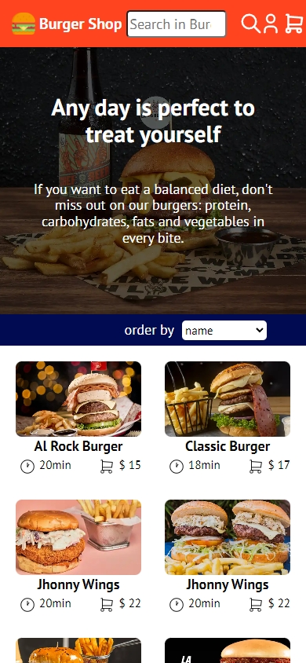
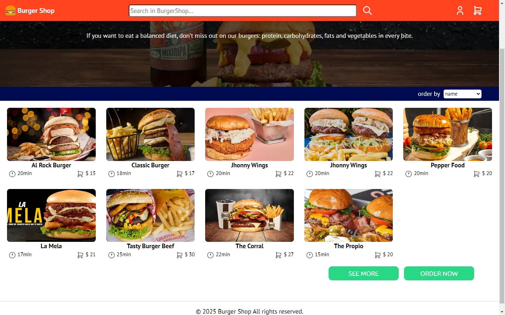

# 🏗️ Proyecto: BurgerShop

📌 **Descripción**  
Este proyecto es una **página web responsiva** desarrollada con HTML y CSS. Su objetivo es proporcionar una **interfaz moderna y accesible** para mostrar información de tienda online para compra de hamburguesas.  

# 🚀 Proyecto en Español
Bienvenido a mi proyecto...
📄 [🇬🇧 English Version](README-en.md)

🌎 **[Demo en vivo](#)** *(Reemplaza con tu link si lo tienes en GitHub Pages, Netlify, etc.)*

---

## 🚀 Tecnologías Utilizadas  
✅ **HTML5** – Estructura semántica  
✅ **CSS3** – Estilos avanzados con flexbox
✅ **Responsive Design** – Adaptable a dispositivos móviles  

---

## 📸 Capturas de pantalla  
  
  

 
---

## 🛠️ Instalación y Uso  
Si quieres probar este proyecto en tu máquina local, sigue estos pasos:

```bash
# Clona el repositorio
git clone https://github.com/ElCamperon/burgershop.github.io

# Abre el archivo index.html en tu navegador
```
## 🎨 Características

✔ Diseño atractivo y moderno
✔ Totalmente responsive
✔ Código limpio y bien estructurado

## 📩 Contacto

👨‍💻 Eliecer Pinto Grisales
📧 eliecer2796@gmail.com

🙌 ¡Gracias por visitar este proyecto! No dudes en contactarme si tienes preguntas.
